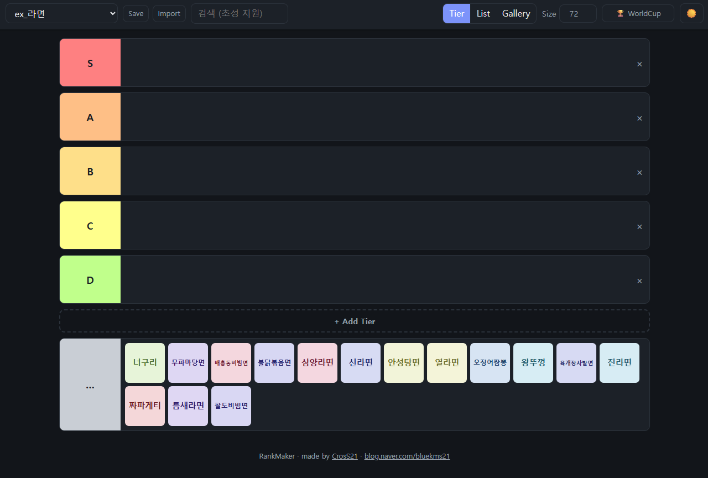
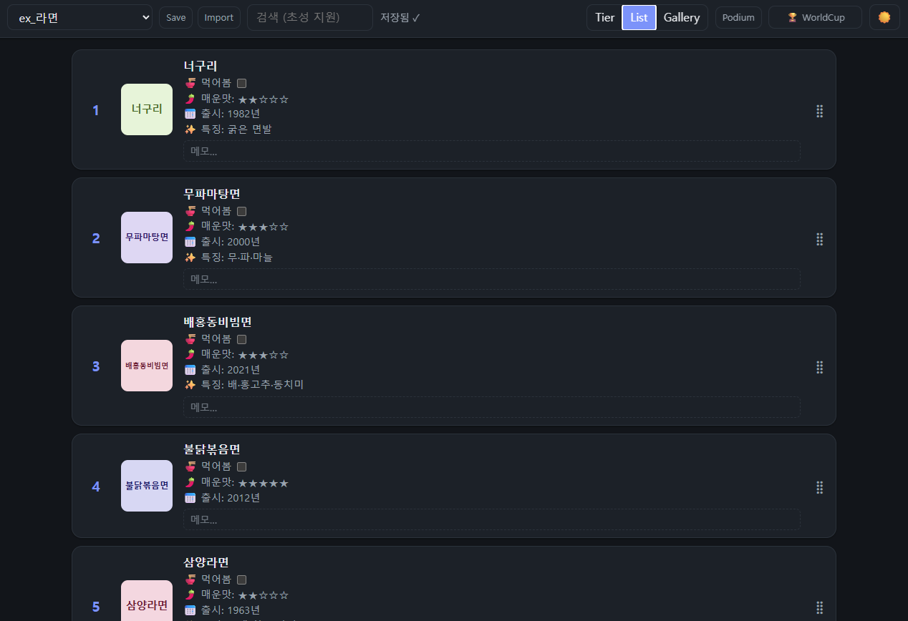
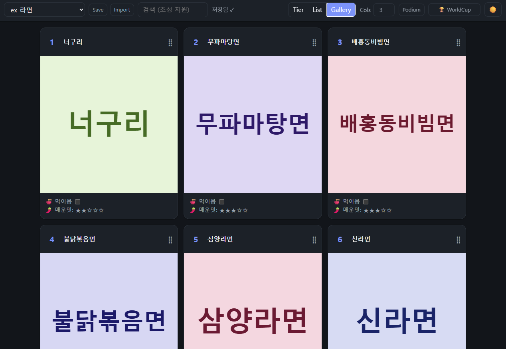
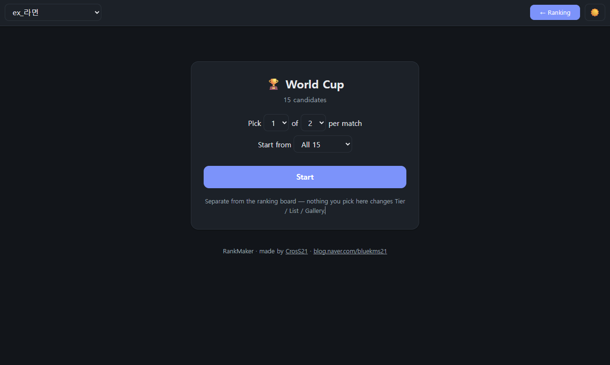
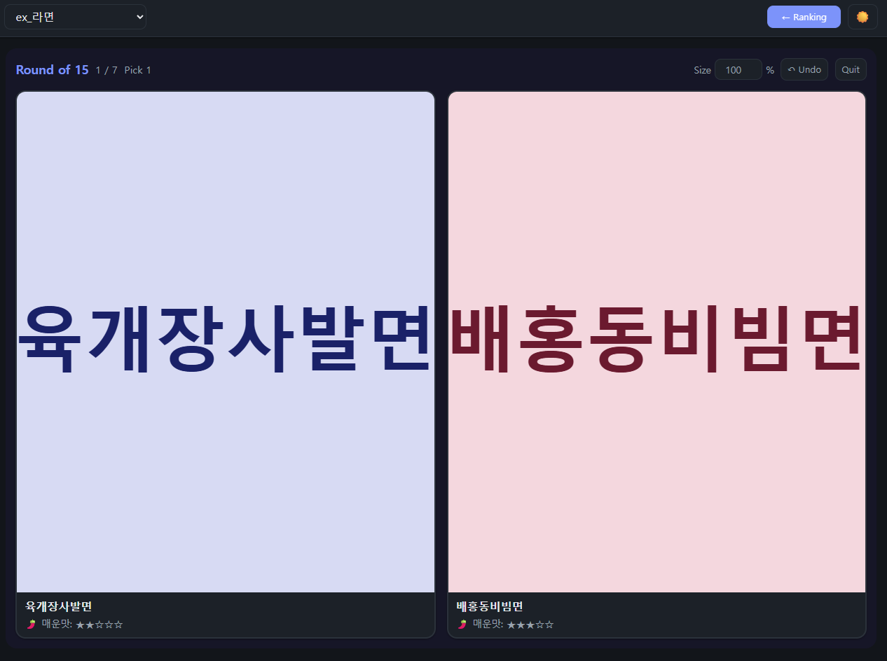
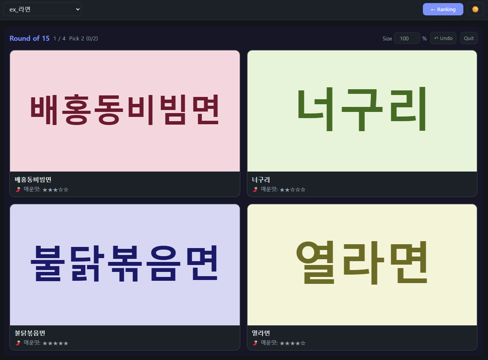
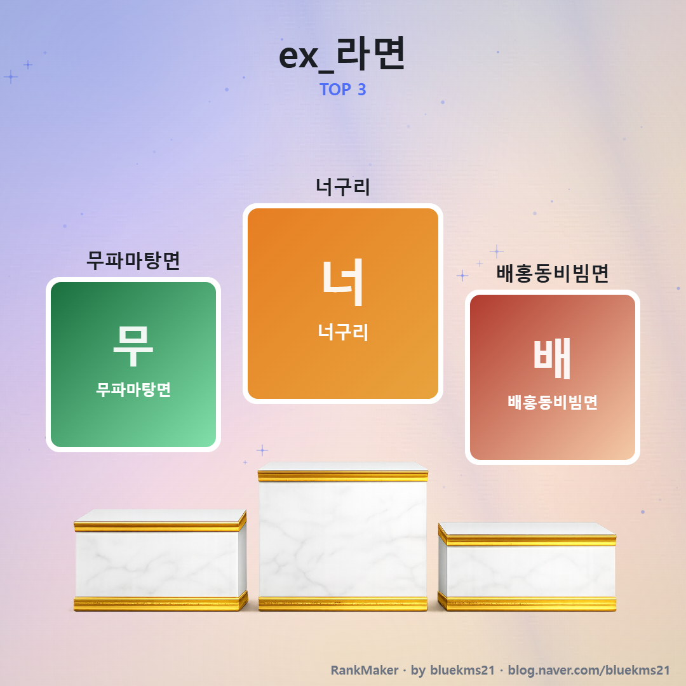
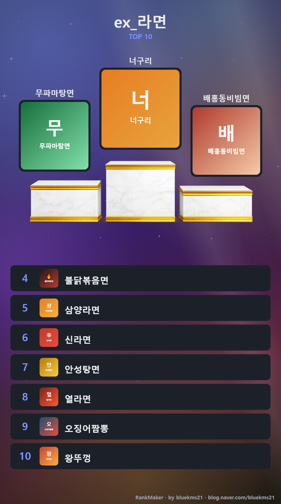

# RankMaker — 보드게임

> **이 브랜치는 보드게임 전용 데이터 브랜치입니다.**
> 국내 유통사 아홉 곳의 보드게임 약 1,400종이 주제로 들어 있습니다.
> 앱 사용법·`info.md` 문법 등 **공통 내용은 원본 README 를 보세요** —
> [한국어](https://github.com/bluekms/rankmaker/blob/main/README.md) · [English](https://github.com/bluekms/rankmaker/blob/main/README.en.md)
>
> 이 브랜치만의 특징은 **그림을 저장소에 담지 않는다**는 점입니다.
> 각 항목의 `info.md` 에 BGG 이미지 주소가 적혀 있어 화면에는 그대로 보이고,
> 포스터를 뽑을 때만 안내창에서 받으면 됩니다 — [그림을 주소로 붙이기](docs/image-url.md)

## 들어 있는 주제

| 주제 | 종수 |
|---|---|
| 팝콘에듀 · 만두게임즈 · 보드엠 · 아스모디코리아 | 각 200~290 |
| 행복한바오밥 · MTSGames · 젬블로컴퍼니 | 각 70~180 |
| 옐로우미플 · 데블다이스 | 각 20~40 |

**그림은 저장소에 없습니다.** `info.md` 의 주소로 뜨고, 포스터를 뽑을 때만 파일이 필요합니다 → **[그림을 주소로 붙이기](docs/image-url.md)**

> **한국어** | [English](README.en.md)

**이미지를 모아 순위를 매기고, SNS용 포스터로 뽑아내는 오프라인 순위표.**
`index.html` 하나로 동작합니다 — 서버도, 설치도, 빌드도 없습니다.

**Tier** 로 대략 나누고 → **List / Gallery** 에서 다듬고 → **Podium** 으로 이미지를 뽑습니다.
여기에 순위와 무관한 **WorldCup**(이상형 월드컵)이 따로 있습니다.

## 시작하기

1. [Releases](https://github.com/bluekms/rankmaker/releases/latest) 에서 zip 을 받아 풉니다.
2. `index.html` 을 브라우저로 엽니다. (Chrome / Edge 권장)
3. **Choose Topics Folder** 로 `topics` 폴더를 고르거나 창에 끌어다 놓습니다.
   열 때마다 한 번 고릅니다 — 브라우저가 마지막 위치를 기억하므로 두 번 누르면 끝입니다.

## 폴더 구조

```
topics/
├── images/           ← 그림은 전부 여기. 모든 주제가 함께 씁니다
│   ├── 신라면.png
│   └── 진라면.png
├── podium.png        ← (선택) 공통 단상 그림
└── 나의주제/
    ├── info.md       ← 무엇이 들어가고 어떻게 설명할지
    └── save.json     ← 순위·체크 — 자동 생성
```

**주제 폴더에는 그림을 두지 않습니다.** 같은 대상을 여러 주제에서 다뤄도 그림은 한 벌만 있으면 됩니다.

> **손으로 만들 필요는 없습니다.** 주제 목록 맨 끝의 **`+ New Topic`** 을 고르고 그림이 든 폴더를 끌어다 놓으면,
> 폴더 이름으로 주제가 만들어지고 그림은 `topics/images/` 로 복사되며 `info.md` 가 이름만 채워 생성됩니다.
>
> 그 아래 **`- Unused Images`** 는 어느 `info.md` 도 부르지 않는 그림을 모아 보여줍니다. 골라서 지우면 됩니다.

## `info.md` 쓰기

```markdown
// 라면 순위          ← 주제 이름 (선택)

# global             ← 모든 아이템에 공통으로 붙는 설명
- 🍜 먹어봄 [ ]

# 신라면.png          ← 아이템 하나. 이름이 곧 topics/images/ 의 파일명
- 🌶️ 매운맛: ★★★☆☆
+ 📅 출시: 1986년
```

| 기호 | 뜻 |
|---|---|
| `# 파일명` | 아이템 하나. `topics/images/` 의 파일명과 정확히 같아야 합니다 |
| `# global` | 모든 아이템 설명 맨 위에 붙습니다 |
| `-` / `+` | 필수 설명(어디서나) / 추가 설명(List 에서만) |
| `[ ]` | 어디에나 넣을 수 있는 체크박스 |
| `//` | 주제 이름 · `dark` · `grid` · `columns: 4` 같은 설정 |

**그림 파일이 없어도 됩니다.** 그때는 이름만 적힌 카드가 나옵니다. 파일 대신 웹 주소를 쓸 수도 있는데, 항목이 아주 많을 때 쓰는 방법이라 [그림을 주소로 붙이기](docs/image-url.md) 에 따로 정리했습니다.

> 예제의 🌶️ 📅 🔗 같은 이모지는 **전부 그냥 글자**입니다. 문법이 아니니 마음대로 바꾸세요.
> 실제로 의미가 있는 것은 `#` `-` `+` `[ ]` `//` 뿐입니다.

## 뷰

Tier · List · Gallery 는 **같은 순위를 공유**합니다. 한 곳에서 바꾸면 나머지에도 반영됩니다.

### Tier — 대략적인 분류부터



티어 행에 끌어다 놓으면 그 티어에 들어가고, **티어 안의 순서가 그대로 순위**가 됩니다.
기본 5개 · `+ Add Tier` 로 추가(최대 10) · `×` 로 삭제 · 라벨 클릭해 이름 변경 · `Size` 로 아이콘 크기 조절.

### List — 상세 순위



순위 숫자를 클릭해 직접 입력, ▲▼ 로 한 칸 이동, `⣿` 핸들로 드래그. 아이템마다 메모를 남길 수 있습니다.

> 순위는 1위부터 빈틈없이 매겨집니다. 동률은 없습니다 — 우열을 가리기 어려우면 같은 티어에 두세요.

### Gallery — 한눈에



`Cols` 로 열 수를 조절합니다.

### 검색과 되돌리기

- **검색** — 기본은 아이템 이름만 찾고 **초성**도 됩니다(`ㅅㄹㅁ` → 신라면). `All Text` 를 켜면 설명까지 넓어지고, 찾은 글자에 표시가 칠해집니다.
- **Undo** — 순서·티어·체크 변경을 50단계까지 되돌립니다. `Ctrl+Z` 도 같습니다.

## WorldCup

**순위표와 완전히 독립된 기능입니다.** 여기서 무엇을 고르든 Tier / List / Gallery 순위는 바뀌지 않습니다.

<p align="center"></p>

기본은 **2개 중 1개**를 고르는 방식이고, `Pick n of m` 으로 바꿀 수 있습니다.

<p align="center">
  
  
</p>

`Start from` 으로 참가 인원(16강, 32강 …)을 정하고, 진행 중에는 `Undo` 로 되돌리거나 `Quit` 로 나갑니다.
결과는 `cup.save.json` 에 따로 기록됩니다.

## Podium — 이미지 출력

List 또는 Gallery 에서 **Podium** 메뉴로 PNG 를 뽑습니다. WorldCup 에서는 우승자 한 명으로 **Winner** 이미지가 만들어집니다.

<p align="center">
  
  
</p>

**단상 그림은 교체할 수 있습니다.** `topics/podium.png` 가 전체 공통이고, `topics/<주제>/podium.png` 를 넣으면 그 주제만 바뀝니다.

> 포스터에는 **그림 파일**이 필요합니다. 주소로만 붙인 그림이 섞여 있으면 안내창이 떠서 받는 방법을 알려줍니다 — [그림을 주소로 붙이기](docs/image-url.md)

## 저장과 백업

- **Chrome / Edge** — 모든 변경이 주제 폴더의 `save.json` 에 즉시 자동 저장됩니다 (`Saved ✓`).
- **Firefox / Safari** — 폴더에 직접 쓸 수 없어 브라우저에 저장됩니다. 백업은 아래 버튼으로 합니다.
- **Save** — 현재 순위를 `save.json` 파일로 내려받습니다.
- **Load** — 내려받은 `save.json` 을 다시 불러옵니다.

## 라이선스

[MIT](LICENSE)

## 개발자

**CrosS21** — [bluekms21@naver.com](mailto:bluekms21@naver.com) · [blog.naver.com/bluekms21](https://blog.naver.com/bluekms21)

이 프로젝트는 [Claude Code](https://claude.com/claude-code)를 이용한 **바이브 코딩**(vibe coding)으로 개발되었습니다.
