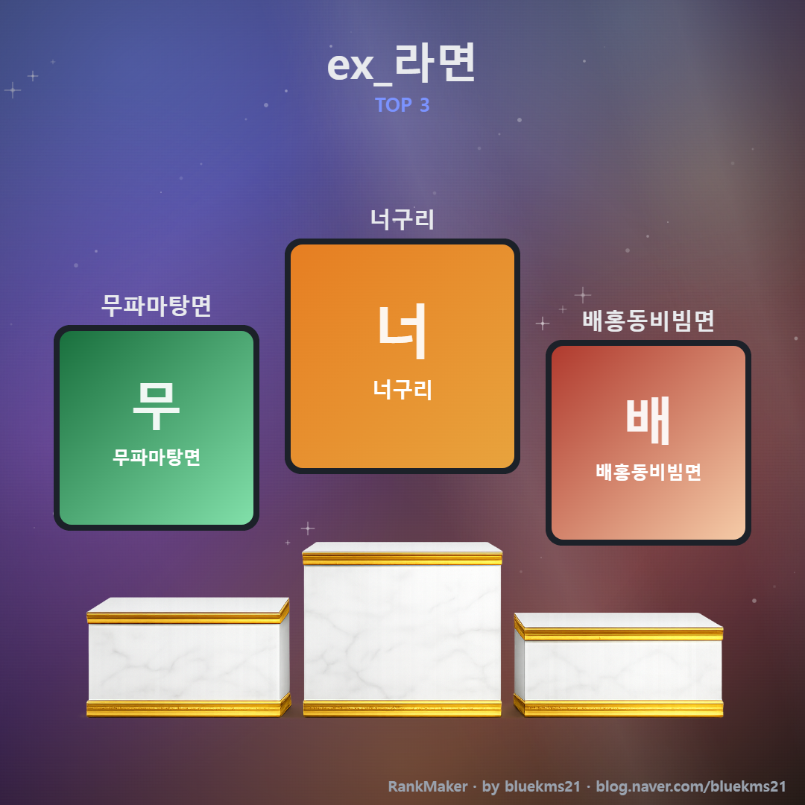
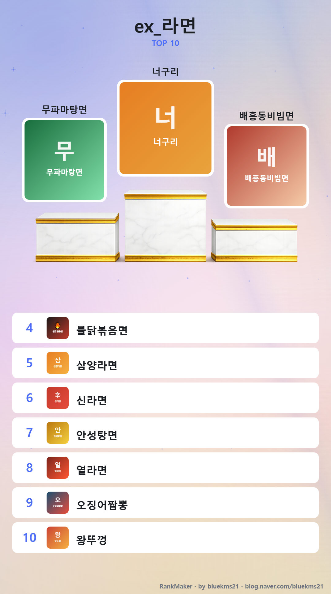

# RankMaker

> **한국어** | [English](README.en.md)

**이미지를 폴더에 넣어 순위를 매기고, 그대로 SNS용 포스터로 뽑아내는 오프라인 순위표.**
`index.html` 하나로 동작합니다 — 서버도, 설치도, 빌드도 없습니다.

<p align="center">
  
  
</p>
<p align="center">
  
  
</p>

- **드래그&드롭으로 순위 조작** — 공동 순위, 한글 초성 검색, 리스트/갤러리/티어 보기
- **데이터는 그냥 파일** — 이미지 + `info.md` + `save.json`, 전부 내 컴퓨터 안에서만
- **원클릭 PNG 출력** — Instagram 1:1 / Top 10 포스터 (위 이미지가 실제 출력물입니다)

## 시작하기

1. 저장소를 클론하거나 ZIP으로 내려받습니다.
2. `index.html`을 브라우저로 엽니다. (Chrome / Edge 권장)
3. **"Connect Topics Folder"** 버튼으로 `topics` 폴더를 선택하거나, 폴더를 창에 끌어다 놓습니다.
   브라우저 보안상 필요한 **최초 1회** 승인이며, 다음 실행부터는 자동으로 열립니다.

> Firefox/Safari는 폴더에 직접 저장하는 대신 브라우저에 저장되며, 백업은 내보내기/가져오기를 사용합니다.

## 주제 만들기

`topics/` 아래 폴더 하나가 순위표 하나입니다. 폴더를 만들고 이미지를 넣으면 끝입니다.

```
topics/
└── 나의주제/
    ├── 아이템1.png    ← 이미지 = 아이템, 파일명 = 이름
    ├── 아이템2.jpg
    ├── info.md        ← (선택) 설명
    └── save.json      ← 순위·체크 상태 — 첫 조작 때 자동 생성
```

## info.md 작성법

```markdown
# global
- 보유 현황: 미보유 [ ] / 보유중 [ ]

# 아이템1.png
- 점수: 8.1           ← "-" 필수 설명: 항상 표시
+ 인원: 2 ~ 4         ← "+" 추가 설명: 리스트형에서만 표시
```

- `# global` — 모든 아이템 설명 맨 위에 공통으로 표시됩니다.
- `# 파일명` — 해당 이미지의 설명. 파일명과 정확히 일치해야 합니다.
- `[ ]` — 어디에나 체크박스를 넣을 수 있습니다. 체크 상태는 `save.json`에 저장됩니다.
- `http(s)://` 주소는 클릭 가능한 링크로 표시됩니다. 이모지(⭐ 👥 📅 …)를 라벨에 붙이면 보기 좋습니다.

## 화면 사용법

| 하고 싶은 것 | 방법 |
|---|---|
| 주제 전환 | 좌상단 드롭다운 |
| 검색 | 헤더 검색창 — 이름·설명 대상, 한글 초성(`ㅅㄹㅁ`) 지원 |
| 보기 전환 | Tier / List / Gallery 버튼. 액자형은 "Cols"로 열 수, 티어형은 "Size"로 아이콘 크기 조절 |
| 티어표 만들기 | Tier 보기 — 행으로 드래그하면 같은 티어(공동 순위), 행 사이 틈은 새 티어. 기본 5개, "+ Add Tier"로 추가(최대 10), ×로 삭제(아이템은 맨 아래 미분류 풀 "…"로 이동). 라벨 클릭으로 이름 변경 |
| 테마 전환 | 우상단 🌙 / ☀️ |
| 순위 한 칸 이동 | 순위 숫자에 마우스를 올리면 나오는 ▲▼ |
| 순위 직접 입력 | 순위 숫자 클릭 → 입력 (Enter 확정 / Esc 취소) |
| 순위 드래그 | 아이템의 ⣿ 핸들을 잡고 원하는 위치로 |
| 이미지로 저장 | "Image Export" 메뉴 → Instagram(1:1, Top 3 단상) / Poster(Top 10) PNG |
| 백업 / 복원 | Export / Import (save.json 파일) |
| 메모 | List 보기에서 각 아이템 아래 입력칸 — 입력 즉시 자동 저장, List에서만 표시 |

- 같은 순위를 입력하면 공동 순위가 됩니다: 1, 1, 1 다음은 4위.
- 아이템 수보다 큰 수(예: 999)는 단독 꼴찌, 0 이하는 단독 1위로 끼워넣어집니다.
- 모든 변경은 즉시 자동 저장됩니다("저장됨 ✓").

## 예제

`ex_` 접두사가 붙은 폴더가 예제입니다. 필요 없어지면 지우면 됩니다.

- `topics/ex_boardgame/` — 보드게임 5종. 3칸 체크박스와 필수/추가 설명 예.
- `topics/ex_라면/` — 라면 5종. 단일 체크박스, 별점(★), 한글 파일명·초성 검색 예.

## 라이선스

[MIT](LICENSE)

## 개발자

**bluekms21** — [bluekms21@naver.com](mailto:bluekms21@naver.com) · [blog.naver.com/bluekms21](https://blog.naver.com/bluekms21)

이 프로젝트는 [Claude Code](https://claude.com/claude-code)를 이용한 **바이브 코딩**(vibe coding)으로 개발되었습니다.
